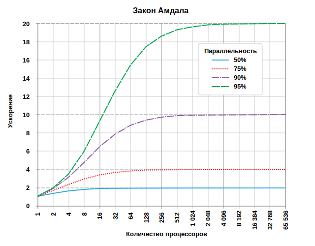
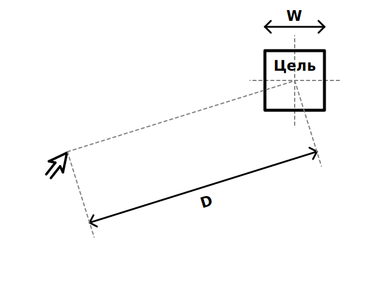
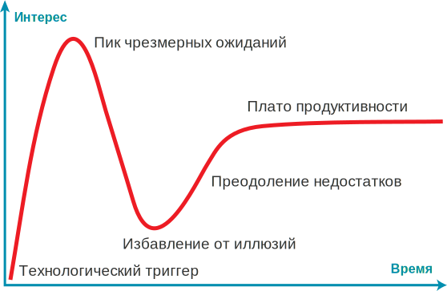

<h1 align="center"><a href="https://hacker-laws.com" target="_blank">hacker-laws</a></h1>
<h4 align="center">🧠 Законы, теории, принципы и паттерны, которые полезно знать участникам разработки ИТ-продуктов.</h4>

---

<!-- vim-markdown-toc GFM -->

- [Введение](#введение)
- [Законы](#законы)
    - [Принцип 90–9–1 (правило 1%)](#принцип-9091-правило-1)
    - [Правило 90–90](#правило-9090)
    - [Закон Амдала](#закон-амдала)
    - [Теория разбитых окон](#теория-разбитых-окон)
    - [Закон Брукса](#закон-брукса)
    - [Теорема CAP / Теорема Брюера](#теорема-cap--теорема-брюера)
    - [Три закона Кларка](#три-закона-кларка)
    - [Закон Конвея](#закон-конвея)
    - [Закон Каннингема](#закон-каннингема)
    - [Число Данбара](#число-данбара)
    - [Эффект Даннинга — Крюгера](#эффект-даннинга--крюгера)
    - [Закон Фиттса](#закон-фиттса)
    - [Закон Галла](#закон-галла)
    - [Закон Гудхарта](#закон-гудхарта)
    - [Бритва Хэнлона](#бритва-хэнлона)
    - [Закон Хика / Закон Хика — Хаймана)](#закон-хика--закон-хика--хаймана)
    - [Закон Хофштадтера](#закон-хофштадтера)
    - [Закон Хатбера](#закон-хатбера)
    - [Цикл хайпа / Закон Амара](#цикл-хайпа--закон-амара)
    - [Закон Хайрама / Закон неявных интерфейсов)](#закон-хайрама--закон-неявных-интерфейсов)
    - [Модель вход-процесс-выход (IPO)](#модель-вход-процесс-выход-ipo)
    - [Закон Кернигана](#закон-кернигана)
    - [Закон Куми](#закон-куми)
    - [Закон Линуса](#закон-линуса)
    - [Закон Меткалфа](#закон-меткалфа)
    - [Закон Мура](#закон-мура)
    - [Закон Мерфи / Закон подлости](#закон-мерфи--закон-подлости)
    - [Бритва Оккама](#бритва-оккама)
    - [Закон Паркинсона](#закон-паркинсона)
    - [Преждевременная оптимизация](#преждевременная-оптимизация)
    - [Закон Патта](#закон-патта)
    - [Закон Рида](#закон-рида)
    - [Горький урок Ричарда Саттона](#горький-урок-ричарда-саттона)
    - [Эффект Рингельмана](#эффект-рингельмана)
    - [Закон сохранения сложности / Закон Теслера](#закон-сохранения-сложности--закон-теслера)
    - [Закон Деметры](#закон-деметры)
    - [Закон дырявых абстракций](#закон-дырявых-абстракций)
    - [Закон инструмента / Закон молотка / Золотой молоток / Молоток Маслоу](#закон-инструмента--закон-молотка--золотой-молоток--молоток-маслоу)
    - [Закон тривиальности](#закон-тривиальности)
    - [Философия Unix](#философия-unix)
    - [Правило бойскаута](#правило-бойскаута)
    - [Модель Spotify](#модель-spotify)
    - [Правило двух пицц](#правило-двух-пицц)
    - [Закон Тваймана](#закон-тваймана)
    - [Закон Уодлера](#закон-уодлера)
    - [Закон Уитона](#закон-уитона)
- [Принципы](#принципы)
    - [Все модели неверны / Закон Джорджа Бокса](#все-модели-неверны--закон-джорджа-бокса)
    - [Забор Честертона](#забор-честертона)
    - [Принцип Керкгоффса](#принцип-керкгоффса)
    - [Эффект Мёртвого моря](#эффект-мёртвого-моря)
    - [Принцип Дилберта](#принцип-дилберта)
    - [Закон Парето / Правило 80/20](#закон-парето--правило-8020)
    - [Принцип Ширки](#принцип-ширки)
    - [Принцип Питера](#принцип-питера)
    - [Принцип надежности / Закон Постела](#принцип-надежности--закон-постела)
    - [SOLID](#solid)
    - [Принцип единственной ответственности](#принцип-единственной-ответственности)
    - [Принцип открытости/закрытости](#принцип-открытостизакрытости)
    - [Принцип подстановки Лисков](#принцип-подстановки-лисков)
    - [Принцип разделения интерфейса](#принцип-разделения-интерфейса)
    - [Принцип инверсии зависимостей](#принцип-инверсии-зависимостей)
    - [DRY / Принцип «не повторяйся»](#dry--принцип-не-повторяйся)
    - [Принцип KISS](#принцип-kiss)
    - [YAGNI](#yagni)
    - [Заблуждения о распределённых вычислениях](#заблуждения-о-распределённых-вычислениях)
    - [Принцип наименьшего удивления](#принцип-наименьшего-удивления)
- [Литература](#литература)
- [Онлайн ресурсы](#онлайн-ресурсы)
- [PDF версия](#pdf-версия)
- [Подкаст](#подкаст)

<!-- vim-markdown-toc -->

## Введение

Существует много законов, которые люди обсуждают, говоря о разработке. В этом репозитории собраны ссылки и обзоры наиболее распространённых. Пожалуйста, делитесь им и присылайте PR'ы!

Предупреждение: этот репозиторий содержит объяснения некоторых законов, принципов и паттернов, но не _агитирует_ ни за один из них. Вопрос о том, стоит ли их применять, всегда будет предметом споров, и ответ на него в значительной степени зависит от того, над чем вы работаете.

## Законы

Законы могут быть как мнениями о неизбежном в мире разработки программного обеспечения так и ироничными замечаниями о неизбежных реалиях.

### Принцип 90–9–1 (правило 1%)

[Правило одного процента на Википедии](https://ru.wikipedia.org/wiki/Правило_одного_процента)

Правило описывает неравномерность участия интернет-аудитории в создании содержимого: 90% участников только потребляют контент, 9% редактируют или изменяют контент и только 1% участников создает контент.

Примеры из жизни:

- Исследование четырех социальных сетей в сфере здравоохранения, проведенное в 2014 году, показало, что 1% самых популярных пользователей создали 73% публикаций, на следующие 9% пришлось в среднем около 25%, а на оставшиеся 90% пришлось в среднем 2%. ([Источник (en)](https://www.jmir.org/2014/2/e33))

См. также:

- [Закон Парето / Правило 80/20](#закон-парето--правило-8020)

### Правило 90–90

[Правило 90–90 на Википедии (en)](https://en.wikipedia.org/wiki/Ninety–ninety_rule)

> На первые 90% кода уходят первые 90% времени разработки. На оставшиеся 10% — остальные 90% времени.

Ироничная интерпретация [принципа Парето](#закон-парето--правило-8020), которая подчеркивает реальные проблемы завершения инженерных работ. Это мнение также отражено в [законе Хофштадтера](#закон-хофштадтера).

См. также:

- [Закон Хофштадтера](#закон-хофштадтера)
- [Закон Парето / Правило 80/20](#закон-парето--правило-8020)

### Закон Амдала

[Закон Амдала на Википедии](https://ru.wikipedia.org/wiki/Закон_Амдала)

> Закон Амдаля — это формула, демонстрирующая _потенциал ускорения_ вычислительной задачи, которого можно достичь при увеличении количества ресурсов системы. Обычно он используется в параллельных вычислениях, и может предсказать наличие реальных преимуществ от увеличения числа процессоров с учётом ограничений распараллеливания программы.

Для наглядности рассмотрим на примере. Если программа состоит из двух частей: части A, которая должна выполняться одним процессором, и части B, которая может выполняться параллельно, то мы увидим, что добавление нескольких процессоров в систему, выполняющую программу, может иметь лишь ограниченное преимущество. Потенциально, это может значительно ускорить часть Б, при этом скорость части А не изменится.

Диаграмма ниже демонстрирует примеры потенциального увеличения скорости:

Как можно видеть, программа с возможностью распараллеливания на 50% принесет очень мало пользы при использовании 10 процессоров, тогда как программа с возможностью распараллеливания на 95% может достичь значительного повышения скорости при использовании более тысячи процессоров.

Поскольку [закон Мура](#закон-мура) и ускорение отдельных процессов замедляется, параллелизация становится ключом к повышению производительности. Программирование графики является прекрасным примером — с современными вычислениями на основе шейдеров отдельные пиксели или фрагменты могут отрисовываться параллельно — вот почему современные графические карты часто имеют много тысяч процессорных ядер (графических процессоров или шейдерных блоков).

См. также:

- [Закон Брукса](#закон-брукса)
- [Закон Мура](#закон-мура)

### Теория разбитых окон

[Теория разбитых окон на Википедии](https://ru.wikipedia.org/wiki/Теория_разбитых_окон)

Теория утверждает, что видимые признаки преступления (или отсутствия заботы об окружающей среде) приводят к дальнейшим и более серьезным преступлениям (или дальнейшему ухудшению состояния окружающей среды).

Эту теорию применяли к разработке ПО, предполагая, что плохое качество кода ([технический долг](#TODO)) может вызвать ощущение того, что все попытки улучшить качество будут проигнорированы или недооценены, что приведёт к появлению нового плохого кода. Этот эффект развивается каскадно, что со временем приводит к значительному снижению качества.

См. также:

- [Технический долг](#TODO)

Примеры:

- [The Pragmatic Programming: Software Entropy (en)](https://flylib.com/books/en/1.315.1.15/1)
- [Coding Horror: The Broken Window Theory (en)](https://blog.codinghorror.com/the-broken-window-theory)
- [OpenSource: Joy of Programming - The Broken Window Theory (en)](https://opensourceforu.com/2011/05/joy-of-programming-broken-window-theory)

### Закон Брукса

[Закон Брукса на Википедии (en)](https://en.wikipedia.org/wiki/Brooks%27s_law)

> Если проект не укладывается в сроки, то добавление рабочей силы задержит его ещё больше.

Закон говорит о том, что во многих случаях попытки ускорить выпуск проекта, который уже опаздывает, путём добавления к нему дополнительных людей, приводит к тому, что проект задерживается еще больше. Брукс подчеркивает, что это чрезмерное упрощение проблемы. Однако общее обоснование заключается в том, что с учетом времени подключения новых ресурсов и издержек коммуникации в краткосрочной перспективе скорость снижается. Кроме того, многие задачи могут быть неделимы, т.е. их не удастся легко распределить между большим количеством ресурсов, что означает, что потенциальное увеличение скорости оказывается не таким значительным.

Распространённое фраза «Девять женщин не смогут родить ребенка за один месяц» относится к закону Брукса, в частности потому, что некоторые виды работ нельзя разделить или распараллелить.

Это главная тема книги «[Мифический человеко-месяц](#литература)».

См. также:

- [Марши смерти](#todo)
- [Литература: Мифический человеко-месяц](#литература)

### Теорема CAP / Теорема Брюера

[Теорема CAP на Википедии](https://ru.wikipedia.org/wiki/Теорема_CAP)

Теорема CAP (определенная Эриком Брюэром) утверждает, что в любой реализации распределенного хранилища данных возможно обеспечить не более двух из трёх следующих свойств:

- согласованность (англ. consistency) – при чтении данных каждый запрос получает _самые последние_ данные, либо возвращается ошибка;
- доступность (англ. availability) – любой запрос на чтение данных получает _ответ без ошибок_, однако без гарантии, что это _самые последние_ данные;
- устойчивость к фрагментации (англ. partition tolerance) – при сбое произвольного количества сетевых запросов между узлами система продолжает работать так, как и ожидалось.

Суть рассуждений такова. Невозможно гарантировать, что разделение сети не произойдет (см. [Заблуждения распределенных вычислений](#заблуждения-о-распределённых-вычислениях)). Поэтому в случае разделения мы можем либо отменить операцию (увеличив согласованность и уменьшив доступность), либо продолжить (увеличив доступность, но уменьшив согласованность).

Название происходит от первых букв гарантий (Consistency, Availability, Partition Tolerance). Обратите внимание, что это _не_ относится к [_ACID_](#TODO), который имеет другое определение согласованности. Совсем недавно была разработана теорема [PACELC](#TODO), которая добавляет ограничения для задержки и согласованности, когда сеть _не_ разделена (т.е. когда система работает так, как и ожидалось).

Большинство современных систем управления базами данных неявно признают эту теорему, предлагая пользователю базы данных возможность выбора между высокодоступной операцией (которая может включать «грязное чтение») и высокопоследовательной операцией (например, «запись с подтверждением кворума»).

Примеры из жизни:

- [Google Cloud Spanner и теорема CAP: как это работает (en)](https://cloud.google.com/blog/products/gcp/inside-cloud-spanner-and-the-cap-theorem) - Подробно описывается принцип работы Cloud Spanner, который на первый взгляд может показаться платформой, обладающей _всеми_ гарантиями CAP, но на самом деле по сути представляет собой систему CP.

См. также:

- [ACID](#TODO)
- [Заблуждения о распределённых вычислениях](#заблуждения-о-распределённых-вычислениях)
- [PACELC](#TODO)

### Три закона Кларка

[Три закона Кларка на Википедии](https://ru.wikipedia.org/wiki/Три_закона_Кларка)

Артур Кларк, британский писатель-фантаст, сформулировал три афоризма, известные как три закона Кларка. Третий закон является наиболее известным и часто цитируемым.

Ниже приведены эти законы:

- Когда уважаемый, но пожилой учёный утверждает, что что-то возможно, то он почти наверняка прав. Когда он утверждает, что что-то невозможно, — он, весьма вероятно, ошибается.
- Единственный способ обнаружения пределов возможного состоит в том, чтобы отважиться шагнуть немного дальше — в невозможное.
- Любая достаточно развитая технология неотличима от магии.

### Закон Конвея

[Закон Конвея на Википедии](https://ru.wikipedia.org/wiki/Закон_Конвея)

Закон говорит о том, что технические рамки проектируемой системы будут отражать структуру организации. Его часто вспоминают в контексте улучшения организации. Согласно этому закон, если организация разделена на множество небольших, не связанных между собой команд, то и производимое ею ПО будет разделено подобным образом. Если организация больше построена вокруг «вертикалей», ориентированных на функции или услуги, то программные системы также будут отражать это.

См. также:

- [Модель Spotify](#модель-spotify)

### Закон Каннингема

[Закон Каннингема на Википедии (en)](https://en.wikipedia.org/wiki/Ward_Cunningham#Cunningham's_Law)

> Лучший способ найти правильный ответ в интернете — не задать вопрос, а опубликовать заведомо неправильный ответ.

По словам Стивена Макгиди, Уорд Каннингем дал ему совет в начале 1980-х: «Лучший способ получить правильный ответ в Интернете — не задавать вопрос, а публиковать неправильный ответ». Макгиди назвал это законом Каннингема, хотя Каннингем отрицает авторство, называя его «неправильным цитированием». Хотя изначально закон относился к взаимодействиям в Usenet, с тех пор закон использовали для описания работы и других сообществ (например, Wikipedia, Reddit, Twitter, Facebook).

См. также:

- [XKCD 386: "Duty Calls" (en)](https://xkcd.com/386)

### Число Данбара

[Число Данбара на Википедии](https://ru.wikipedia.org/wiki/Число_Данбара)

«Число Данбара — предполагаемое когнитивное ограничение на количество человек, с которыми можно поддерживать стабильные социальные отношения — отношения, в которых человек знает, кто каждый человек и как каждый человек относится к каждому другому человеку». Существуют некоторые разногласия по поводу точного числа. «... [Данбар] предположил, что люди могут комфортно поддерживать только 150 стабильных отношений». Он поместил это число в более социальный контекст, «число людей, к которым вы не смутитесь присоединиться без приглашения, чтобы выпить, если вы случайно столкнетесь с ними в баре». Оценки этого числа обычно лежат в диапазоне от 100 до 250.

Как и стабильные отношения между людьми, отношения разработчика с кодовой базой требуют усилий для поддержки. Когда мы сталкиваемся с большими сложными проектами или ведем множество проектов, мы опираемся на соглашения, политику и смоделированную процедуру масштабирования. Число Данбара вважно принимать во внимание не только по мере роста офиса, но и при определении размера команды или принятии решения о том, когда система должна инвестировать в инструменты для помощи в моделировании и автоматизации логистических издержек. В инженерном контексте число указывает на количество проектов (или нормализованная сложность одного проекта), для которых вы бы с уверенностью вошли в дежурную команду поддержки.

См. также:

- [Закон Конвея](#закон-конвея)

### Эффект Даннинга — Крюгера

[Эффект Даннинга — Крюгера на Википедии](https://ru.wikipedia.org/wiki/Эффект_Даннинга_—_Крюгера)

> Если вы некомпетентны, вы не можете знать об этом... Навыки, необходимые для получения правильного ответа, — это именно те навыки, которые вам нужны для распознавания правильного ответа.
>
> _[Дэвид Даннинг](https://ru.wikipedia.org/wiki/Даннинг,_Дэвид)_

Эффект представляет собой теоретическую когнитивную ошибку, описанную Дэвидом Даннингом и Джастином Крюгером в психологическом исследовании и статье 1999 года. Исследование показывает, что люди с низким уровнем компетентности в определённой задаче склонны переоценивать свои способности в ней. Предполагаемая причина этой ошибки заключается в том, что для формирования обоснованного мнения о своей способности работать в определённой области человеку необходимо достаточное _осознание_ сложности проблемы или самой области.

Эффект Даннинга — Крюгера иногда используется для описания связанного, но не всегда прямо подразумеваемого явления, которое можно сформулировать так: «Чем меньше человек понимает область, тем больше он склонен считать, что легко решит задачи в ней, воспринимая эту область как _простую_». Этот более общий эффект особенно актуален в технологической сфере. Он предполагает, что люди, слабо знакомые с областью, например, нетехнические члены команды или менее опытные сотрудники, чаще склонны _недооценивать_ усилия, необходимые для решения проблем в этой сфере.

По мере роста понимания и опыта человека в области может проявиться другой эффект: он начинает _переоценивать_ способности _других_ или _недооценивать_ свои собственные, поскольку становится настолько опытным, что теряет объективность. Во всех случаях эти явления являются _когнитивными искажениями_. Как и с любыми искажениями, осознание их существования часто помогает избежать связанных с ними сложностей — зная о предвзятости, можно привлечь дополнительные мнения и данные, чтобы нивелировать её. Близким по смыслу искажением является [Иллюзорное превосходство](https://ru.wikipedia.org/wiki/Иллюзорное_превосходство).

### Закон Фиттса

[Закон Фиттса на Википедии](https://ru.wikipedia.org/wiki/Закон_Фиттса)

Закон утверждает, что время движения к цели прямо пропорционально расстоянию до цели, и обратно пропорционально ширине цели.

Из закона следует, что при при проектировании пользовательского опыта (UX) или интерфейса (UI) интерактивные элементы должны быть как можно больше, а расстояние между областью внимания пользователя и такими элементами — как можно меньше. Это влияет на дизайнерские решения, например, требует группировать часто используемые вместе задачи и располагать их рядом.

Также он формализует концепцию «волшебных углов» — углов экрана, в которые пользователь может «переместить» курсор мыши для быстрого доступа к элементам интерфейса. Именно в таких зонах рекомендуется размещать ключевые UI-элементы. Например, кнопка «Пуск» в Windows находится в «волшебном углу», что облегчает её выбор. Что интересно, в отличие от этого, кнопка закрытия окна в macOS _не_ расположена в таком углу, что снижает вероятность случайного нажатия.

См. также:

- [Информационная пропускная способность человеческой моторной системы при управлении амплитудой движения (en)](https://www.semanticscholar.org/paper/The-information-capacity-of-the-human-motor-system-Fitts/634c9fde5f1c411e4487658ac738dcf18d98ea8d)

### Закон Галла

[Закон Галла на Википедии (en)](https://en.wikipedia.org/wiki/John_Gall_(author)#Gall's_law)

> Работающая сложная система свегда происходит из работавшей простой системы. Сложная система, разработанная с нуля, никогда не работает, и её невозможно исправить так, чтобы она заработала. Нужно начать заново, с простой работающей системы.
>
> _[Джон Галл (en)](https://en.wikipedia.org/wiki/John_Gall_(author))_

Закон подразумевает, что попытки _спроектировать_ высокосложные системы, скорее всего, потерпят неудачу. Высокосложные системы редко строятся за один раз, чаще всего они развиваются из более простых систем.

Классический пример — всемирная сеть. В своем нынешнем состоянии это очень сложная система. Однако изначально она создавалась как простой способ обмена контентом между академическими учреждениями. на очень успешно справилась с этими целями и со временем эволюционировала, становясь все более сложной.

См. также:

- [Принцип KISS (Keep It Simple, Stupid)](#принцип-kiss)

### Закон Гудхарта

[Закон Гудхарта на Википедии](https://ru.wikipedia.org/wiki/Закон_Гудхарта)

> Любая наблюдаемая статистическая закономерность склонна разрушаться, если на нее оказывается давление с целью контроля.
>
> _[Чарльз Гудхарт](https://ru.wikipedia.org/wiki/Гудхарт,_Чарльз)_

Также часто упоминается как:

> Когда мера становится целью, она перестает быть хорошей мерой.
>
> _[Мэрилин Стратерн](https://ru.wikipedia.org/wiki/Стратерн,_Мэрилин)_

Закон гласит, что оптимизация на основе измерений может привести к обесцениванию самого результата измерений. Чрезмерно избирательный набор показателей ([KPIs](https://ru.wikipedia.org/wiki/Ключевые_показатели_эффективности)), слепо применяемый к процессу, приводит к искажениям. Люди склонны оптимизировать процесс локально, «обманывая» систему, чтобы достич конкретных метрик, вместо того, чтобы обращать внимание на глобальный результат своих действий.

Примеры из жизни:

- Тесты без утверждений удовлетворяют ожиданиям по покрытию кода, несмотря на то, что целью метрики было создание хорошо протестированного программного обеспечения.
- Оценка эффективности разработчика на основе количества строк, внесённых в проект, приводит к неоправданному раздуванию кода.

См. также:

- [Закон Гудхарта: как измерение не тех показателей провоцирует аморальное поведение (en)](https://coffeeandjunk.com/goodharts-campbells-law)
- [Закон Дилберта о безбаговом ПО (en)](https://dilbert.com/strip/1995-11-13)

### Бритва Хэнлона

[Бритва Хэнлона на Википедии](https://ru.wikipedia.org/wiki/Бритва_Хэнлона)

> Никогда не приписывайте злому умыслу то, что вполне можно объяснить глупостью.
>
> _Роберт Дж. Хэнлон_

Принцип утверждает, что действия, приведшие к негативному результату, могли производиться не с дурными намерениями. Негативный результат с большей вероятностью объясняется тем, что эти действия и их последствия недостаточно хорошо были поняты.

### Закон Хика / Закон Хика — Хаймана

[Закон Хика на Википедии (en)](https://en.wikipedia.org/wiki/Hick%27s_law)

> Время принятия решения увеличивается логарифмически с ростом количества доступных вариантов.
>
> _Уильям Эдмунд Хик и Рэя Хайман_

В приведённом ниже уравнении `T` — это время принятия решения, `n` — количество вариантов выбора, а `b` — константа, определяемая на основе анализа данных.

Этот закон применим только в случае, когда варианты выбора _упорядочены_ (например, по алфавиту). Это подразумевается в логарифме по основанию два — это означает, что принимающий решение, по сути, выполняет _бинарный поиск_. Если варианты не упорядочены, эксперименты показывают, что время принятия решения становится линейным.

Это имеет важное значение для дизайна пользовательского интерфейса: обеспечение удобного поиска среди вариантов позволяет ускорить принятие решений.

В законе Хика также показана корреляция между IQ и временем реакции, как показано в исследовании [Скорость обработки информации: изменения в процессе развития и связь с интеллектом (en)](https://www.sciencedirect.com/science/article/pii/S0022440599000369).

См. также:

- [Закон Фиттса](#закон-фиттса)

### Закон Хофштадтера

[Закон Хофштадтера на Википедии (en)](https://en.wikipedia.org/wiki/Hofstadter%27s_law)

> Любое дело всегда длится дольше, чем ожидается, даже если учесть закон Хофштадтера.
>
> _[Дуглас Хофштадтер](https://ru.wikipedia.org/wiki/Хофштадтер,_Дуглас)_

Закон часто упоминается при оценке времени выполнения задач. В разработке программного обеспечения давно известно, что мы обычно плохо справляемся с точной оценкой сроков реализации.

Упоминается в книге «[Гёдель, Эшер, Бах: эта бесконечная гирлянда](#литература)».

См. также:

- [Литература: Гёдель, Эшер, Бах: эта бесконечная гирлянда](#литература)

### Закон Хатбера

[Закон Хатбера на Википедии (en)](https://en.wikipedia.org/wiki/Hutber%27s_law)

> Улучшение означает ухудшение.
>
> _[Патрик Хатбер (en)](https://en.wikipedia.org/wiki/Patrick_Hutber)_

Закон утверждает, что улучшение одной части системы ведёт к ухудшению других её частей, или прячет иные существующие проблемы, что в итоге приводит к общей деградации системы по сравнению с её текущим состоянием.

Например, уменьшение задержки ответа для конкретного конечного пункта может вызвать проблемы с пропускной способностью и нагрузкой дальше по пути потока запросов, затронув другую подсистему.

### Цикл хайпа / Закон Амара

[Цикл хайпа на Википедии](https://ru.wikipedia.org/wiki/Gartner#Цикл_хайпа)

> Мы склонны переоценивать влияние технологии в краткосрочной перспективе и недооценивать его в долгосрочной.
>
> _[Рой Амара (en)](https://en.wikipedia.org/wiki/Roy_Amara)_

Цикл шумихи – визуализация динамики ожиданий и развития технологий с течением времени, первоначально разработанное компанией Gartner. Наиболее наглядно его можно продемонстрировать с помощью графика:

Если коротко, этот цикл показывает, что вокруг новых технологий обычно возникает волна ажиотажа и завышенных ожиданий. Команды часто спешат их внедрить, но затем сталкиваются с разочарованием — либо потому что технология ещё не созрела, либо потому что её практическое применение ещё не до конца понятно. Со временем возможности технологии развиваются, появляются реальные варианты использования, и только тогда начинается продуктивная работа. Лучше всего это резюмирует фраза Роя Амары: «Мы склонны переоценивать влияние технологии в краткосрочной перспективе и недооценивать в долгосрочной».

### Закон Хайрама / Закон неявных интерфейсов

[Сайт закона Хайрама (en)](http://www.hyrumslaw.com)

> При достаточном количестве пользователей API не имеет значения, что вы обещали в документации — кто-то обязательно начнёт зависеть от любого наблюдаемого поведения вашей системы.
>
> _[Хайрам Райт (en)](https://www.hyrumwright.org/)_

См. также:

- [Закон дырявых абстракций](#закон-дырявых-абстракций)
- [XKCD 1172 (en)](https://xkcd.com/1172)

### Модель вход-процесс-выход (IPO)

[Модель вход-процесс-выход на Википедии (en)](https://en.wikipedia.org/wiki/IPO_model)

Системы могут быть невероятно сложными, но обычно их можно разбить на более мелкие части, работающие по простой схеме:

1. получение входных данных (Input).
2. выполнение обработки или преобразования (Processing),
3. возврат результата (Output).

Классическим примером паттерна IPO может служить функция сортировки, которая принимает произвольные входные данные, упорядочивает их по заданному условию и возвращает результат. Этот же принцип применим к веб-серверам (преобразование HTTP-запросов в ответы) и даже к сложным генеративным ИИ-системам, где пользовательский ввод обрабатывается сложной моделью для формирования ответа.

Модель IPO существует в разных воплощениях практически во всех технологических сферах. Она явно прослеживается в [функциональных языках программирования](https://ru.wikipedia.org/wiki/Функциональное_программирование) и лежит в основе [философии Unix](#философия-unix), согласно которой сложные системы следует строить путем комбинирования множества простых программ, работающих по принципу «ввод-обработка-вывод».

См. также:

- [Философия Unix](#философия-unix)

### Закон Кернигана

> Отладка кода в два раза тяжелее, чем его написание. Поэтому, если вы пишете код на пределе своих умственных возможностей, вам не хватит ума, чтобы его отладить.
>
> _[Брайан Керниган](https://ru.wikipedia.org/wiki/Керниган,_Брайан)_

Закон Кернигана назван в честь [Брайана Кернигана](https://ru.wikipedia.org/wiki/Керниган,_Брайан), который сформулировал его в совместной с П.Д. Плогером в книге [Элементы стиля программирования](https://rusneb.ru/catalog/000200_000018_rc_892612):

> Все знают, что отладка программы вдвое сложнее её написания. Так как же вы сможете её отладить, если написали на пределе своей сообразительности?

Хотя и звучит преувеличением, закон Кернигана утверждает: простой код предпочтительнее сложного, поскольку отладка проблем в сложном коде может быть дорогостоящей или даже невозможной.

См. также:

- [Принцип KISS](#принцип-kiss)
- [Философия Unix](#философия-unix)
- [Бритва Оккама](#бритва-оккама)

### Закон Куми

[Закон Куми на Википедии (en)](https://en.wikipedia.org/wiki/Koomey%27s_law)

> ...при одной и той же вычислительной нагрузке объем необходимой вам батареи будет уменьшаться в два раза каждые полтора года.
>
> _[Джонатан Куми (en)](https://en.wikipedia.org/wiki/Jonathan_Koomey)_

В 2010 году профессор Джонатан Куми обнаружил, что тенденция роста количества вычислений на джоуль затрачиваемой энергии оставалась удивительно стабильной. Эта закономерность стала известна как закон Куми — ёмкость аккумулятора, необходимая для заданной вычислительной нагрузки, уменьшается вдвое каждые 2,5 года.

В последующем анализе 2020 года Куми выявил замедление этой тенденции, аналогичное замедлению [закона Мур](#закон-мура). Это связано с фундаментальными физическими ограничениями на минимальный размер транзисторов и прекращением [масштабирования Деннарда](https://ru.wikipedia.org/wiki/Закон_масштабирования_Деннарда).

См. также:

- [Закон Мура](#закон-мура)
- [Закон масштабирования Деннарда](https://ru.wikipedia.org/wiki/Закон_масштабирования_Деннарда)

### Закон Линуса

[Закон Линуса на Википедии](https://ru.wikipedia.org/wiki/Закон_Линуса)

> Чем больше людей смотрят код — тем проще найти ошибки
>
> _[Эрик С. Рэймонд](https://ru.wikipedia.org/wiki/Реймонд,_Эрик_Стивен)_

Этот закон утверждает, что чем больше людей видят проблему, тем выше вероятность, что кто-то уже сталкивался с подобным и нашёл решение.

Хотя изначально он описывал преимущества open-source разработки, он применим к любым программным проектам. Его можно расширить и на процессы: дополнительные код-ревью, статический анализ и междисциплинарное тестирование делают проблемы более заметными и легко идентифицируемыми.

Более формальное утверждение может быть таким:

> При достаточно большой базе бета-тестеров и соразработчиков практически любая проблема будет быстро идентифицирована и может быть решена кем-то, кто уже сталкивался с аналогичной задачей ранее.

Этот закон был назван в честь [Линуса Торвальдса](https://ru.wikipedia.org/wiki/Торвальдс,_Линус) в книге Эрика С. Рэймонда «[Собор и Базар](https://ru.wikipedia.org/wiki/Собор_и_Базар)».

### Закон Меткалфа

[Закон Меткалфа на Википедии](https://ru.wikipedia.org/wiki/Закон_Меткалфа)

> В теории сетей ценность системы растёт приблизительно пропорционально квадрату числа её пользователей.

Данный закон основан на количестве возможных парных соединений в системе и тесно связан с [законом Рида](#закон-рида). Однако, как отмечают Одлызко и другие исследователи, как закон Рида, так и закон Меткалфа преувеличивают ценность системы, не учитывая ограничения человеческого познания на сетевые эффекты.

См. также:

- [Закон Рида](#закон-рида)
- [Число Данбара](#число-данбара)

### Закон Мура

[Закон Мура на Википедии](https://ru.wikipedia.org/wiki/Закон_Мура)

> Количество транзисторов в интегральной схеме удваивается примерно каждые два года.

Прогноз Мура, часто используемый для иллюстрации стремительного прогресса в развитии полупроводниковых технологий и микрочипов, демонстрировал удивительную точность с 1970-х до конца 2000-х годов. В последнее время эта тенденция несколько изменилась, отчасти из-за [физических ограничений на дальнейшую миниатюризацию компонентов](https://ru.wikipedia.org/wiki/Туннельный_эффект). Однако достижения в области параллельных вычислений и потенциально революционные изменения в полупроводниковых технологиях и квантовых вычислениях могут означать, что закон Мура останется актуальным в течение ближайших десятилетий.

См. также:

- [Закон Куми](#закон-куми)

### Закон Мерфи / Закон подлости

[Закон Мерфи на Википедии](https://ru.wikipedia.org/wiki/Закон_Мерфи)

> Если что-то может пойти не так, оно обязательно пойдет не так.

Закон Мерфи, сформулированный [Эдвардом А. Мерфи-младший](https://ru.wikipedia.org/wiki/Мёрфи,_Эдвард), гласит, что если что-то может пойти не так, оно обязательно пойдет не так.

Это распространенная поговорка среди разработчиков: неожиданные сбои происходят на этапах разработки, тестирования и даже в продакшене. Схожий смысл имеет (более распространенный в британском английском) _Закон подлости_:

> Если что-то может пойти не так, оно пойдёт не так в самый неподходящий момент.

Хотя эти «законы» обычно упоминаются в юмористическом смысле, такие когнитивные искажения как _Предвзятость подтверждения_ и _Систематическая ошибка отбора_ заставляют людей переоценивать их значимость. В действительности большинство успешных операций остаются незамеченными, тогда как неудачи привлекают повышенное внимание и активнее обсуждаются.

См. также:

- [Предвзятость подтверждения](#TODO)
- [Систематическая ошибка отбора](#TODO)

### Бритва Оккама

[Бритва Оккама на Википедии](https://ru.wikipedia.org/wiki/Бритва_Оккама)

> Не следует привлекать новые сущности без крайней на то необходимости
>
> _[Уильям Оккам](https://ru.wikipedia.org/wiki/Оккам,_Уильям)_

Бритва Оккама гласит, что среди нескольких возможных решений наиболее вероятным является то, которое содержит наименьшее количество концепций и допущений. Это решение — самое простое и решает исключительно поставленную задачу, не внося побочной сложности и потенциальных негативных последствий.

См. также:

- [YAGNI](#yagni)
- [Серебряной пули нет: побочная и объективная сложности](https://ru.wikipedia.org/wiki/Серебряной_пули_нет)

Примеры:

- [Бережливая разработка ПО: Устранение потерь](https://ru.wikipedia.org/wiki/Бережливая_разработка_программного_обеспечения)

### Закон Паркинсона

[Закон Паркинсона на Википедии](https://ru.wikipedia.org/wiki/Законы_Паркинсона)

> Work expands so as to fill the time available for its completion.

In its original context, this Law was based on studies of bureaucracies. It may be pessimistically applied to software development initiatives, the theory being that teams will be inefficient until deadlines near, then rush to complete work by the deadline, thus making the actual deadline somewhat arbitrary.

См. также:

- [Закон Хофштадтера](#закон-хофштадтера)

### Преждевременная оптимизация

[Преждевременная оптимизация на WikiWeb (en)](http://wiki.c2.com/?PrematureOptimization)

> Premature optimization is the root of all evil.
>
> _[Donald Knuth](https://twitter.com/realdonaldknuth?lang=en)_

However, _Premature Optimization_ can be defined (in less loaded terms) as optimizing before we know that we need to.

### Закон Патта

[Закон Патта на Википедии (en)](https://en.wikipedia.org/wiki/Putt%27s_Law_and_the_Successful_Technocrat)

> Technology is dominated by two types of people, those who understand what they do not manage and those who manage what they do not understand.

Putt's Law is often followed by Putt's Corollary:

> Every technical hierarchy, in time, develops a competence inversion.

These statements suggest that due to various selection criteria and trends in how groups organise, there will be a number of skilled people at working levels of a technical organisations, and a number of people in managerial roles who are not aware of the complexities and challenges of the work they are managing. This can be due to phenomena such as [The Peter Principle](#принцип-питера) or [The Dilbert Principle](#принцип-дилберта).

However, it should be stressed that Laws such as this are vast generalisations and may apply to _some_ types of organisations, and not apply to others.

См. также:

- [Принцип Питера](#принцип-питера)
- [Принцип Дилберта](#принцип-дилберта)

### Закон Рида

[Закон Рида на Википедии (en)](https://en.wikipedia.org/wiki/Reed's_law)

> The utility of large networks, particularly social networks, scales exponentially with the size of the network.

This law is based on graph theory, where the utility scales as the number of possible sub-groups, which is faster than the number of participants or the number of possible pairwise connections. Odlyzko and others have argued that Reed's Law overstates the utility of the system by not accounting for the limits of human cognition on network effects; see [Dunbar's Number](#число-данбара).

См. также:

- [Закон Меткалфа](#закон-меткалфа)
- [Число Данбара](#число-данбара)

### Горький урок Ричарда Саттона

[Горький урок Ричарда Саттона (en)](http://www.incompleteideas.net/IncIdeas/BitterLesson.html)

> The biggest lesson that can be read from 70 years of AI research is that general methods that leverage computation are ultimately the most effective, and by a large margin.
>
> _Richard S. Sutton (2019)_

The "Bitter Lesson", stated by [Rich S. Sutton](https://en.wikipedia.org/wiki/Richard_S._Sutton), says that scale (in terms of both data and computational power) has driven the most significant advancements in AI research, rather than the intricacies of the research methods themselves.

He goes on to suggest that this indicates we should stop trying to build simplified (or even complex) models of the mind as history has shown that these have always in the long term been failures compared to (as an example) scaling the capacity of neural networks and applying existing methods such as convolution.

### Эффект Рингельмана

[Эффект Рингельмана на Википедии](https://ru.wikipedia.org/wiki/Эффект_Рингельмана)

The Ringelmann Effect is the tendency of an individual to become increasingly inefficient as more and more people are involved in a task. In other words, as more individuals are added to a team, the more the average individual performance decreases. Multiple causes are believed to be at work, including loss of motivation ("[social loafing](https://en.wikipedia.org/wiki/Social_loafing)") and challenges related to coordination.

См. также:

- [Закон Брукса](#закон-брукса)

### Закон сохранения сложности / Закон Теслера

[Закон сохранения сложности на Википедии (en)](https://en.wikipedia.org/wiki/Law_of_conservation_of_complexity)

This law states that there is a certain amount of complexity in a system which cannot be reduced.

Some complexity in a system is 'inadvertent'. It is a consequence of poor structure, mistakes, or just bad modeling of a problem to solve. Inadvertent complexity can be reduced (or eliminated). However, some complexity is 'intrinsic' as a consequence of the complexity inherent in the problem being solved. This complexity can be moved, but not eliminated.

One interesting element to this law is the suggestion that even by simplifying the entire system, the intrinsic complexity is not reduced, it is _moved to the user_, who must behave in a more complex way.

### Закон Деметры

[Закон Деметры на Википедии](https://ru.wikipedia.org/wiki/Закон_Деметры)

> Don't talk to strangers.

The Law of Demeter, also known as "The Principle of Least Knowledge" is a principle for software design, particularly relevant in object orientated languages.

It states that a unit of software should talk only to its immediate collaborators. An object `A` with a reference to object `B` can call its methods, but if `B` has a reference to object `C`, `A` should not call `C`s methods. So, if `C` has a `doThing()` method, `A` should not invoke it directly; `B.getC().doThis()`.

Following this principal limits the scope of changes, making them easier and safer in future.

### Закон дырявых абстракций

[Закон дырявых абстракций на сайте Joel on Software (en)](https://www.joelonsoftware.com/2002/11/11/the-law-of-leaky-abstractions)

> All non-trivial abstractions, to some degree, are leaky.
>
> _[Joel Spolsky](https://twitter.com/spolsky)_

This law states that abstractions, which are generally used in computing to simplify working with complicated systems, will in certain situations 'leak' elements of the underlying system, this making the abstraction behave in an unexpected way.

The example above can become more complex when _more_ abstractions are introduced. The Linux operating system allows files to be accessed over a network but represented locally as 'normal' files. This abstraction will 'leak' if there are network failures. If a developer treats these files as 'normal' files, without considering the fact that they may be subject to network latency and failures, the solutions will be buggy.

The article describing the law suggests that an over-reliance on abstractions, combined with a poor understanding of the underlying processes, actually makes dealing with the problem at hand _more_ complex in some cases.

См. также:

- [Закон Хайрама / Закон неявных интерфейсов)](#закон-хайрама--закон-неявных-интерфейсов)

Real-world examples:

- [Photoshop Slow Startup](https://forums.adobe.com/thread/376152) - an issue I encountered in the past. Photoshop would be slow to startup, sometimes taking minutes. It seems the issue was that on startup it reads some information about the current default printer. However, if that printer is actually a network printer, this could take an extremely long time. The _abstraction_ of a network printer being presented to the system similar to a local printer caused an issue for users in poor connectivity situations.

### Закон инструмента / Закон молотка / Золотой молоток / Молоток Маслоу

[Золотой молоток на Википедии](https://ru.wikipedia.org/wiki/Золотой_молоток)

> I call it the law of the instrument, and it may be formulated as follows: Give a small boy a hammer, and he will find that everything he encounters needs pounding.
>
> _Abraham Kaplan_

> If all you have is a hammer, everything looks like a nail.
>
> _Abraham Maslow_

In the context of computer programming, this law suggests that people tend to use tools that are familiar with, rather than the best possible tool. This over-reliance on a familiar tool is an anti-pattern referred to as 'the golden hammer'.

See also:

- [Avoiding the law of the instrument](https://josemdev.com/avoiding-the-law-of-the-instrument)
- [Anti-Pattern - The Golden Hammer](https://archive.org/details/antipatternsrefa0000unse/page/111/mode/2up)

### Закон тривиальности

[Закон тривиальности на Википедии](https://ru.wikipedia.org/wiki/Закон_тривиальности)

This law suggests that groups will give far more time and attention to trivial or cosmetic issues rather than serious and substantial ones.

The common fictional example used is that of a committee approving plans for nuclear power plant, who spend the majority of their time discussing the structure of the bike shed, rather than the far more important design for the power plant itself. It can be difficult to give valuable input on discussions about very large, complex topics without a high degree of subject matter expertise or preparation. However, people want to be seen to be contributing valuable input. Hence a tendency to focus too much time on small details, which can be reasoned about easily, but are not necessarily of particular importance.

The fictional example above led to the usage of the term 'Bike Shedding' as an expression for wasting time on trivial details. A related term is '[Yak Shaving](https://en.wiktionary.org/wiki/yak_shaving),' which connotes a seemingly irrelevant activity that is part of a long chain of prerequisites to the main task.

### Философия Unix

[Философия Unix на Википедии](https://ru.wikipedia.org/wiki/Философия_Unix)

The Unix Philosophy is that software components should be small, and focused on doing one specific thing well. This can make it easier to build systems by composing together small, simple, well-defined units, rather than using large, complex, multi-purpose programs.

Modern practices like 'Microservice Architecture' can be thought of as an application of this law, where services are small, focused and do one specific thing, allowing complex behaviour to be composed of simple building blocks.

### Правило бойскаута

[Правило бойскаута на сайте O'Reilly (en)](https://www.oreilly.com/library/view/97-things-every/9780596809515/ch08.html)

> Always leave the code better than you found it.
>
> _Robert C. Martin (Uncle Bob)_

Based on the "Scout Rule", which is "always leave the campground cleaner than you found it", the Scout Rule in programming is simply "always leave the code cleaner than you found it".

This was introduced in the first chapter of the book [Clean Code](https://www.goodreads.com/book/show/3735293-clean-code) by Bob Martin. The rule suggests that developers should perform 'optimistic refactoring', which means to endeavour to improve the overall quality of the code when you work on it. If you see a mistake, attempt to fix it or clean it up. However, when making changes to code which seems incorrect, it may be worth remembering [Chesterton's Fence](#забор-честертона)!

См. также:

- [Литература: Чистый код. Создание, анализ и рефакторинг](#литература)
- [Забор Честертона](#забор-честертона)
- [Теория разбитых окон](#теория-разбитых-окон)

https://www.amazon.sg/Clean-Code-Handbook-Software-Craftsmanship/dp/0132350882

### Модель Spotify

[Модель Spotify на сайте Spotify Labs (en)](https://labs.spotify.com/2014/03/27/spotify-engineering-culture-part-1)

The Spotify Model is an approach to team and organisation structure which has been popularised by 'Spotify'. In this model, teams are organised around features, rather than technologies.

The Spotify Model also popularises the concepts of Tribes, Guilds, Chapters, which are other components of their organisation structure.

Members of the organisation have described that the actual meaning of these groups changes, evolves and is an on-going experiment. The fact that the model is a _process in motion_, rather than a fixed model continues to lead to varying interpretations of the structure, which may be based on presentations given by employees at conferences. This means 'snapshots' may be 're-packaged' by third parties as a _fixed structure_, with the fact that the model is dynamic being lost.

### Правило двух пицц

> If you can't feed a team with two pizzas, it's too large.
>
> _Jeff Bezos_

This rule suggests that regardless of the size of the company, teams should be small enough to be fed by two pizzas. Attributed to Jeff Bezos and Amazon, this belief suggests that large teams are inherently inefficient. This is supported by the fact that as the team size increases linearly, the links between people increases quadratically; thus the cost of coordinating and communicating also grows quadratically. If this cost of coordination is essentially overhead, then smaller teams should be preferred.

The number of links between people can be expressed as `n(n-1)/2` where n = number of people.

### Закон Тваймана

[Закон Тваймана на Википедии (en)](https://en.wikipedia.org/wiki/Twyman%27s_law)

> The more unusual or interesting the data, the more likely they are to have been the result of an error of one kind or another.

This law suggests that when there are particularly unusual data points, it is more likely that they are the result of errors or manipulation. For example, if a dataset of long-jump results from a sporting event showed a maximum value of 20 meters (more than twice the world record), it is more likely to be due to an error (such as recording a value in feet rather than meters) than due to an unusually long jump. It is also more likely in this case that the results could have been manipulated.

См. также:

- [Стандарт Сагана](#TODO)

### Закон Уодлера

[Закон Уодлера на wiki.haskell.org (en)](https://wiki.haskell.org/Wadler's_Law)

> In any language design, the total time spent discussing a feature in this list is proportional to two raised to the power of its position.
>
> 0. Semantics
> 1. Syntax
> 2. Lexical syntax
> 3. Lexical syntax of comments
>
> (In short, for every hour spent on semantics, 8 hours will be spent on the syntax of comments).

Similar to [The Law of Triviality](#закон-тривиальности), Wadler's Law states what when designing a language, the amount of time spent on language structures is disproportionately high in comparison to the importance of those features.

См. также:

- [Закон тривиальности](#закон-тривиальности)

### Закон Уитона

[Сайт закона Уитона (en)](http://www.wheatonslaw.com)

[Официальный сайт «дня не будь придурком»](https://dontbeadickday.com)

> Don't be a dick.
>
> _Wil Wheaton_

Coined by Wil Wheaton (Star Trek: The Next Generation, The Big Bang Theory), this simple, concise, and powerful law aims for an increase in harmony and respect within a professional organization. It can be applied when speaking with coworkers, performing code reviews, countering other points of view, critiquing, and in general, most professional interactions humans have with each other.

## Принципы

Принципы, как правило, представляют собой рекомендации, касающиеся дизайна.

### Все модели неверны / Закон Джорджа Бокса

[Все модели неверны на Википедии (en)](https://en.wikipedia.org/wiki/All_models_are_wrong)

> All models are wrong, but some are useful.
>
> _George Box_

This principle suggests that all models of systems are flawed, but that as long as they are not _too_ flawed they may be useful. This principle has its roots in statistics but applies to scientific and computing models as well.

A fundamental requirement of most software is to model a system of some kind. Regardless of whether the system being modeled is a computer network, a library, a graph of social connections or any other kind of system, the designer will have to decide an appropriate level of detail to model. Excessive detail may lead to too much complexity, too little detail may prevent the model from being functional.

См. также:

- [Закон дырявых абстракций](#закон-дырявых-абстракций)

### Забор Честертона

[Забор Честертона на Википедии (en)](https://en.wikipedia.org/wiki/Wikipedia:Chesterton%27s_fence)

> Reforms should not be made until the reasoning behind the existing state of affairs is understood.

This principle is relevant in software engineering when removing technical debt. Each line of a program was originally written by someone for some reason. Chesterton's Fence suggests that one should try to understand the context and meaning of the code fully, before changing or removing it, even if at first glance it seems redundant or incorrect.

The name of this principle comes from a story by [G.K. Chesterton](https://en.wikipedia.org/wiki/G._K._Chesterton). A man comes across a fence crossing the middle of the road. He complains to the mayor that this useless fence is getting in the way, and asks to remove it. The mayor asks why the fence is there in the first place. When the man says he doesn't know, the mayor says, "If you don't know its purpose, I certainly won't let you remove it. Go and find out the use of it, and then I may let you destroy it."

### Принцип Керкгоффса

[Принцип Керкгоффса на Википедии](https://ru.wikipedia.org/wiki/Принцип_Керкгоффса)

> "...design your system assuming that your opponents know it in detail."
>
> _Steven M. Bellovin's formulation of Kerckhoff's Principle_

This principle of cryptography was an axiom created by cryptographer Auguste Kerckhoffs. He stated that a cryptosystem should be secure, even if everything about the system, except the key, is public knowledge. Not to be confused with [_"security through obscurity"_](#todo).

The gold standard for any secret-keeping system is that implementation details should be publicly distributed, without sacrificing or compromising security of said system.

The history of cryptography has shown that open discussion and analysis of cryptographic systems leads to better and more secure systems - as researchers are able to test for and expose potential vulnerabilities.

См. также:

- [Максима Шеннона / Принципом Керкгоффса](#todo)

### Эффект Мёртвого моря

[Эффект Мёртвого моря на сайте Брюса Ф. Вебстера (en)](http://brucefwebster.com/2008/04/11/the-wetware-crisis-the-dead-sea-effect)

> "... [T]he more talented and effective IT engineers are the ones most likely to leave - to evaporate ... [those who tend to] remain behind [are] the 'residue' — the least talented and effective IT engineers."
>
> _Bruce F. Webster_

The "Dead Sea Effect" suggests that in any organisation, the skills/talent/efficacy of engineers is often inversely proportional to their time in the company.

Typically, highly skilled engineers find it easy to gain employment elsewhere and are the first to do so. Engineers who have obsolete or weak skills will tend to remain with the company, as finding employment elsewhere is difficult. This is particularly pronounced if they have gained incremental pay rises over their time in the company, as it can be challenging to get equivalent remuneration elsewhere.

### Принцип Дилберта

[Принцип Дилберта на Википедии (en)](https://en.wikipedia.org/wiki/Dilbert_principle)

> Companies tend to systematically promote incompetent employees to management to get them out of the workflow.
>
> _Scott Adams_

A management concept developed by Scott Adams (creator of the Dilbert comic strip), the Dilbert Principle is inspired by [The Peter Principle](#принцип-питера). Under the Dilbert Principle, employees who were never competent are promoted to management in order to limit the damage they can do. Adams first explained the principle in a 1995 Wall Street Journal article, and expanded upon it in his 1996 business book, [The Dilbert Principle](#литература).

См. также:

- [Принцип Питера](#принцип-питера)
- [Закон Патта](#закон-патта)

### Закон Парето / Правило 80/20

[Закон Парето на Википедии](https://ru.wikipedia.org/wiki/Закон_Парето)

> Most things in life are not distributed evenly.

The Pareto Principle suggests that in some cases, the majority of results come from a minority of inputs:

- 80% of a certain piece of software can be written in 20% of the total allocated time (conversely, the hardest 20% of the code takes 80% of the time)
- 20% of the effort produces 80% of the result
- 20% of the work creates 80% of the revenue
- 20% of the bugs cause 80% of the crashes
- 20% of the features cause 80% of the usage

In the 1940s American-Romanian engineer Dr. Joseph Juran, who is widely credited with being the father of quality control, [began to apply the Pareto principle to quality issues](https://en.wikipedia.org/wiki/Joseph_M._Juran).

This principle is also known as: The 80/20 Rule, The Law of the Vital Few, and The Principle of Factor Sparsity.

Real-world examples:

- In 2002 Microsoft reported that by fixing the top 20% of the most-reported bugs, 80% of the related errors and crashes in windows and office would become eliminated ([Reference](https://www.crn.com/news/security/18821726/microsofts-ceo-80-20-rule-applies-to-bugs-not-just-features.htm)).

### Принцип Ширки

[Принцип Ширки на сайте Кевина Келли (en)](https://kk.org/thetechnium/the-shirky-prin)

> Institutions will try to preserve the problem to which they are the solution.
>
> _Clay Shirky_

The Shirky Principle suggests that complex solutions - a company, an industry, or a technology - can become so focused on the problem that they are solving, that they can inadvertently perpetuate the problem itself. This may be deliberate (a company striving to find new nuances to a problem which justify continued development of a solution), or inadvertent (being unable or unwilling to accept or build a solution which solves the problem completely or obviates it).

Related to:

- Upton Sinclair's famous line, _"It is difficult to get a man to understand something, when his salary depends upon his not understanding it!"_
- Clay Christensen's _The Innovator's Dilemma_

См. также:

- [Закон Парето / Правило 80/20](#закон-парето--правило-8020)

### Принцип Питера

[Принцип Питера на Википедии](https://ru.wikipedia.org/wiki/Принцип_Питера)

> People in a hierarchy tend to rise to their "level of incompetence".
>
> _Laurence J. Peter_

A management concept developed by Laurence J. Peter, the Peter Principle observes that people who are good at their jobs are promoted, until they reach a level where they are no longer successful (their "level of incompetence"). At this point, as they are more senior, they are less likely to be removed from the organisation (unless they perform spectacularly badly) and will continue to reside in a role which they have few intrinsic skills at, as their original skills which made them successful are not necessarily the skills required for their new jobs.

This is of particular interest to engineers - who initially start out in deeply technical roles, but often have a career path which leads to _managing_ other engineers - which requires a fundamentally different skill set.

См. также:

- [Принцип Дилберта](#принцип-дилберта)
- [Закон Патта](#закон-патта)

### Принцип надежности / Закон Постела

[Принцип надежности на Википедии (en)](https://en.wikipedia.org/wiki/Robustness_principle)

> Be conservative in what you do, be liberal in what you accept from others.

Often applied in server application development, this principle states that what you send to others should be as minimal and conformant as possible, but you should aim to allow non-conformant input if it can be processed.

The goal of this principle is to build systems which are robust, as they can handle poorly formed input if the intent can still be understood. However, there are potentially security implications of accepting malformed input, particularly if the processing of such input is not well tested. These implications and other issues are described by Eric Allman in [The Robustness Principle Reconsidered](https://queue.acm.org/detail.cfm?id=1999945).

Allowing non-conformant input, in time, may undermine the ability of protocols to evolve as implementors will eventually rely on this liberality to build their features.

См. также:

- [Закон Хайрама / Закон неявных интерфейсов)](#закон-хайрама--закон-неявных-интерфейсов)

### SOLID

This is an acronym, which refers to:

These are key principles in [Object-Oriented Programming](#todo). Design principles such as these should be able to aid developers build more maintainable systems.

### Принцип единственной ответственности

[Принцип единственной ответственности на Википедии](https://ru.wikipedia.org/wiki/Принцип_единственной_ответственности)

> Every module or class should have a single responsibility only.

The first of the '[SOLID](#solid)' principles. This principle suggests that modules or classes should do one thing and one thing only. In more practical terms, this means that a single, small change to a feature of a program should require a change in one component only. For example, changing how a password is validated for complexity should require a change in only one part of the program.

Theoretically, this should make the code more robust, and easier to change. Knowing that a component being changed has a single responsibility only means that _testing_ that change should be easier. Using the earlier example, changing the password complexity component should only be able to affect the features which relate to password complexity. It can be much more difficult to reason about the impact of a change to a component which has many responsibilities.

См. также:

- [Объектно-ориентированное программирование](#todo)
- [SOLID](#solid)

### Принцип открытости/закрытости

[Принцип открытости/закрытости на Википедии](https://ru.wikipedia.org/wiki/Принцип_открытости/закрытости)

> Entities should be open for extension and closed for modification.

The second of the '[SOLID](#solid)' principles. This principle states that entities (which could be classes, modules, functions and so on) should be able to have their behaviour _extended_, but that their _existing_ behaviour should not be able to be modified.

As a hypothetical example, imagine a module which is able to turn a Markdown document into HTML. Now imagine there is a new syntax added to the Markdown specification, which adds support for mathematical equations. The module should be _open to extension_ to implement the new mathematics syntax. However, existing syntax implementations (like paragraphs, bullets, etc) should be _closed for modification_. They already work, we don't want people to change them.

This principle has particular relevance for object-oriented programming, where we may design objects to be easily extended, but would avoid designing objects which can have their existing behaviour changed in unexpected ways.

См. также:

- [Объектно-ориентированное программирование](#todo)
- [SOLID](#solid)

### Принцип подстановки Лисков

[Принцип подстановки Лисков на Википедии](https://ru.wikipedia.org/wiki/Принцип_подстановки_Лисков)

> It should be possible to replace a type with a subtype, without breaking the system.

The third of the '[SOLID](#solid)' principles. This principle states that if a component relies on a type, then it should be able to use subtypes of that type, without the system failing or having to know the details of what that subtype is.

As an example, imagine we have a method which reads an XML document from a structure which represents a file. If the method uses a base type 'file', then anything which derives from 'file' should be usable in the function. If 'file' supports seeking in reverse, and the XML parser uses that function, but the derived type 'network file' fails when reverse seeking is attempted, then the 'network file' would be violating the principle.

This principle has particular relevance for object-oriented programming, where type hierarchies must be modeled carefully to avoid confusing users of a system.

См. также:

- [Объектно-ориентированное программирование](#todo)
- [SOLID](#solid)

### Принцип разделения интерфейса

[Принцип разделения интерфейса на Википедии](https://ru.wikipedia.org/wiki/Принцип_разделения_интерфейса)

> No client should be forced to depend on methods it does not use.

The fourth of the '[SOLID](#solid)' principles. This principle states that consumers of a component should not depend on functions of that component which it doesn't actually use.

As an example, imagine we have a method which reads an XML document from a structure which represents a file. It only needs to read bytes, move forwards or move backwards in the file. If this method needs to be updated because an unrelated feature of the file structure changes (such as an update to the permissions model used to represent file security), then the principle has been invalidated. It would be better for the file to implement a 'seekable-stream' interface, and for the XML reader to use that.

This principle has particular relevance for object-oriented programming, where interfaces, hierarchies and abstract types are used to [minimise the coupling](#todo) between different components. [Duck typing](#todo) is a methodology which enforces this principle by eliminating explicit interfaces.

См. также:

- [Объектно-ориентированное программирование](#todo)
- [SOLID](#solid)
- [Утиная типизация](#todo)
- [Развязка](#todo)

### Принцип инверсии зависимостей

[Принцип инверсии зависимостей на Википедии](https://en.wikipedia.org/wiki/Принцип_инверсии_зависимостей)

> High-level modules should not be dependent on low-level implementations.

The fifth of the '[SOLID](#solid)' principles. This principle states that higher-level orchestrating components should not have to know the details of their dependencies.

As an example, imagine we have a program which read metadata from a website. We would assume that the main component would have to know about a component to download the webpage content, then a component which can read the metadata. If we were to take dependency inversion into account, the main component would depend only on an abstract component which can fetch byte data, and then an abstract component which would be able to read metadata from a byte stream. The main component would not know about TCP/IP, HTTP, HTML, etc.

This principle is complex, as it can seem to 'invert' the expected dependencies of a system (hence the name). In practice, it also means that a separate orchestrating component must ensure the correct implementations of abstract types are used (e.g. in the previous example, _something_ must still provide the metadata reader component a HTTP file downloader and HTML meta tag reader). This then touches on patterns such as [Inversion of Control](#todo) and [Dependency Injection](#todo).

См. также:

- [Объектно-ориентированное программирование](#todo)
- [SOLID](#solid)
- [Инверсия управления](#todo)
- [Внедрение зависимости](#todo)

### DRY / Принцип «не повторяйся»

[DRY на Википедии](https://ru.wikipedia.org/wiki/Don%27t_repeat_yourself)

> Every piece of knowledge must have a single, unambiguous, authoritative representation within a system.

DRY is an acronym for _Don't Repeat Yourself_. This principle aims to help developers reducing the repetition of code and keep the information in a single place and was cited in 1999 by Andrew Hunt and Dave Thomas in the book [The Pragmatic Programmer](https://en.wikipedia.org/wiki/The_Pragmatic_Programmer)

> The opposite of DRY would be _WET_ (Write Everything Twice or We Enjoy Typing).

In practice, if you have the same piece of information in two (or more) different places, you can use DRY to merge them into a single one and reuse it wherever you want/need.

See also:

- [The Pragmatic Programmer](https://en.wikipedia.org/wiki/The_Pragmatic_Programmer)

### Принцип KISS

[KISS на Википедии](https://ru.wikipedia.org/wiki/KISS_(принцип))

> Keep it simple, stupid

The KISS principle states that most systems work best if they are kept simple rather than made complicated; therefore, simplicity should be a key goal in design, and unnecessary complexity should be avoided.  Originating in the U.S. Navy in 1960, the phrase has been associated with aircraft engineer Kelly Johnson.

The principle is best exemplified by the story of Johnson handing a team of design engineers a handful of tools, with the challenge that the jet aircraft they were designing must be repairable by an average mechanic in the field under combat conditions with only these tools. Hence, the "stupid" refers to the relationship between the way things break and the sophistication of the tools available to repair them, not the capabilities of the engineers themselves.

См. также:

- [Закон Галла](#закон-галла)

### YAGNI

[YAGNI на Википедии](https://ru.wikipedia.org/wiki/YAGNI)

> Always implement things when you actually need them, never when you just foresee that you need them.
>
> _[Ron Jeffries](https://twitter.com/RonJeffries) (XP co-founder and author of the book "Extreme Programming Installed")_

This _Extreme Programming_ (XP) principle suggests developers should only implement functionality that is needed for the immediate requirements, and avoid attempts to predict the future by implementing functionality that might be needed later.

Adhering to this principle should reduce the amount of unused code in the codebase, and avoid time and effort being wasted on functionality that brings no value.

См. также:

- [Литература: Extreme Programming Installed](#литература)

### Заблуждения о распределённых вычислениях

[Заблуждения о распределённых вычислениях на Википедии](https://ru.wikipedia.org/wiki/Заблуждения_о_распределённых_вычислениях)

Also known as _Fallacies of Networked Computing_, the Fallacies are a list of conjectures (or beliefs) about distributed computing, which can lead to failures in software development. The assumptions are:

- The network is reliable
- Latency is zero
- Bandwidth is infinite
- The network is secure
- Topology doesn't change
- There is one administrator
- Transport cost is zero
- The network is homogeneous

The first four items were listed by [Bill Joy](https://en.wikipedia.org/wiki/Bill_Joy) and [Tom Lyon](https://twitter.com/aka_pugs) around 1991 and first classified by [James Gosling](https://en.wikipedia.org/wiki/James_Gosling) as the "Fallacies of Networked Computing". [L. Peter Deutsch](https://en.wikipedia.org/wiki/L._Peter_Deutsch) added the 5th, 6th and 7th fallacies. In the late 90's Gosling added the 8th fallacy.

The group was inspired by what was happening at the time inside [Sun Microsystems](https://en.wikipedia.org/wiki/Sun_Microsystems).

These fallacies should be considered carefully when designing code which is resilient; assuming any of these fallacies can lead to flawed logic which fails to deal with the realities and complexities of distributed systems.

See also:

- [Foraging for the Fallacies of Distributed Computing (Part 1) - Vaidehi Joshi on Medium (en)](https://medium.com/baseds/foraging-for-the-fallacies-of-distributed-computing-part-1-1b35c3b85b53)

### Принцип наименьшего удивления

[Принцип наименьшего удивления на Википедии](https://ru.wikipedia.org/wiki/Правило_наименьшего_удивления)

> People are part of the system. The design should match the user's experience, expectations, and mental models.
>
> _Frans Kaashoek_

This principle proposes that systems and interfaces should be designed in a way that features and functionality is easily discovered and matches users expectations. Features that 'surprise' users should be discouraged in favour of features that can be intuitively reasoned about based on existing patterns and practices.

Many examples are present in user interfaces, such as a 'pull down' gesture on a mobile appliation to refresh content. Another example would be command line tools, where many standards exist for how parameters are named, common parameters that should be available and so on.

См. также:

- [Соглашения по конфигурации](#todo)

## Литература

Если эти концепции показались вам интересными, вам могут понравиться следующие книги:

- [Чистый код. Создание, анализ и рефакторинг – Роберт Мартин](https://www.piter.com/product/chistyy-kod-sozdanie-analiz-i-refaktoring-biblioteka-programmista-45ccca) – одна из самых уважаемых книг о том, как писать чистый и удобный для поддержки код.
- [Extreme Programming Installed – Ron Jeffries, Ann Anderson, Chet Hendrikson (en)](https://www.goodreads.com/en/book/show/67834) – охватывает основные принципы экстремального программирования.
- [Гёдель, Эшер, Бах: эта бесконечная гирлянда – Дуглас Хофштадтер](https://www.livelib.ru/book/1000005849-gedel-esher-bah-eta-beskonechnaya-girlyanda-daglas-hofshtadter) – эту книгу трудно классифицировать. [Закон Хофштадтера](#закон-хофштадтера) из этой книги.
- [Структура и Интерпретация Компьютерных Программ – Харольд Абельсон, Джеральд Джей Сассман, Джули Сассман](https://www.livelib.ru/book/1000799728-struktura-i-interpretatsiya-kompyuternyh-programm-dzhuli-sassman) – если вы были студентом факультета компьютерных наук или электротехники в Массачусетском технологическом институте или Кембридже, это было вашим введением в программирование. Широко известно, что это был поворотный момент в жизни многих людей.
- [Собор и Базар – Эрик Стивен Реймонд](https://www.livelib.ru/work/1000216789-sobor-i-bazar-erik-s-rejmond) – сборник эссе об открытом исходном коде. [Закон Линуса](#закон-линуса) из этой книги.
- [The Dilbert Principle – Scott Adams (en)](https://www.goodreads.com/book/show/85574.The_Dilbert_Principle) – юмористический взгляд на корпоративную Америку от автора [принципа Дилберта](#принцип-дилберта).
- [Мифический человеко-месяц, или Как создаются программные системы – Фредерик Брукс мл.](https://www.piter.com/product/mificheskiy-cheloveko-mesyats-ili-kak-sozdayutsya-programmnye-sistemy) – классический труд по программной инженерии. [Закон Брукса](#закон-брукса) является центральной темой книги.
- [Принцип Питера, или Почему дела всегда идут вкривь и вкось – Лоуренс Джонстон Питер, Реймонд Халл](https://azbooka.ru/books/printsip-pitera-ili-pochemy-dela-vsegda-idyt-vkriv-i-vkos) – еще один юмористический взгляд на проблемы крупных организаций и управления людьми, источник принципа [Принцип Питера](#принцип-питера).

## Онлайн ресурсы

Некоторые полезные ресурсы и материалы для чтения.

- [CB Insights: 8 законов, ведущих к успеху в технологиях: правило «двух пицц» Amazon, принцип 80/20 и другие (en)](https://www.cbinsights.com/research/report/tech-laws-success-failure) – интересное описание некоторых законов, оказавших большое влияние на технологии.

## PDF версия

Проект доступен в виде электронной книги в формате PDF. [Загрузите последнюю версию электронной книги в формате PDF по этой ссылке](https://github.com/dwmkerr/hacker-laws/releases/latest/download/hacker-laws.pdf) или проверьте страницу [релиза](https://github.com/dwmkerr/hacker-laws/releases) для более ранних версий.

Новая версия электронной книги создается автоматически при добавлении тега новой версии.

## Подкаст

Hacker Laws был представлен в подкасте [The Changelog (en)](https://changelog.com/podcast/403). Вы можете ознакомиться с эпизодом по ссылке ниже:

